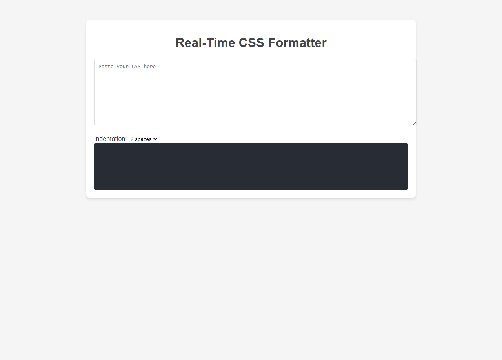

# Real-Time CSS Formatter

A lightweight, web-based tool to format and beautify CSS code. This tool is ideal for developers who need to quickly reformat messy or minified CSS into a clean, readable format.

## Features

- **CSS Formatting**: Beautifies messy or minified CSS code with proper indentation.
- **Custom Indentation**: Allows users to select the number of spaces for indentation (e.g., 2, 4, 6, or 8 spaces).
- **Real-Time Updates**: Formats the CSS as you type or paste the code.
- **Error Handling**: Detects invalid CSS syntax and provides feedback.

## Demo

### [Live Website](https://velimirpaleksic.github.io/real-time-css-formatter/)

## How to Use

1. Open the `index.html` file in your browser.
2. Paste or type your CSS code into the input text area.
3. Select the desired indentation level from the dropdown menu.
4. View the formatted CSS in the output section.
5. If there are syntax issues, a generic error message will be displayed.

### Bugs & features 🧩
- [Report bug](https://github.com/velimirpaleksic/real-time-css-formatter/issues)
- [Request Feature](https://github.com/velimirpaleksic/real-time-css-formatter/issues)